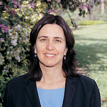

<table class="infobox biography vcard">
<tbody>
<tr>
<th colspan="2">

Shafi Goldwasser

</th>
</tr>
<tr>
<td colspan="2"></td>
</tr>
<tr>
<th scope="row">Born</th>
<td>

Shafrira Goldwasser

 1958 

<a title="New York City" href="https://en.wikipedia.org/wiki/New_York_City">New York City</a>,&nbsp;<a title="New York (state)" href="https://en.wikipedia.org/wiki/New_York_(state)">New York</a>, U.S.

</td>
</tr>
<tr>
<th scope="row">Nationality</th>
<td class="category"><a class="mw-redirect" title="Israeli American" href="https://en.wikipedia.org/wiki/Israeli_American">Israeli American</a></td>
</tr>
<tr>
<th scope="row">Alma&nbsp;mater</th>
<td>

<ul>
<li><a title="Carnegie Mellon University" href="https://en.wikipedia.org/wiki/Carnegie_Mellon_University">Carnegie Mellon University</a>&nbsp;(BS)</li>
<li><a title="University of California, Berkeley" href="https://en.wikipedia.org/wiki/University_of_California,_Berkeley">University of California, Berkeley</a>&nbsp;(PhD)</li>
</ul>

</td>
</tr>
<tr>
<th scope="row">Known&nbsp;for</th>
<td>

<ul>
<li><a title="Blum&ndash;Goldwasser cryptosystem" href="https://en.wikipedia.org/wiki/Blum%E2%80%93Goldwasser_cryptosystem">Blum&ndash;Goldwasser cryptosystem</a></li>
<li><a title="Goldwasser&ndash;Micali cryptosystem" href="https://en.wikipedia.org/wiki/Goldwasser%E2%80%93Micali_cryptosystem">Goldwasser&ndash;Micali cryptosystem</a></li>
</ul>

</td>
</tr>
<tr>
<th scope="row">Awards</th>
<td>

<ul>
<li><a title="Grace Murray Hopper Award" href="https://en.wikipedia.org/wiki/Grace_Murray_Hopper_Award">Grace Murray Hopper Award</a>&nbsp;(1996)</li>
<li><a title="G&ouml;del Prize" href="https://en.wikipedia.org/wiki/G%C3%B6del_Prize">G&ouml;del Prize</a>&nbsp;(1993, 2001)</li>
<li><a title="IEEE Emanuel R. Piore Award" href="https://en.wikipedia.org/wiki/IEEE_Emanuel_R._Piore_Award">IEEE Emanuel R. Piore Award</a>&nbsp;(2011)</li>
<li><a title="Turing Award" href="https://en.wikipedia.org/wiki/Turing_Award">ACM Turing Award</a>&nbsp;(2012)</li>
</ul>

</td>
</tr>
<tr>
<td colspan="2"><strong>Scientific career</strong></td>
</tr>
<tr>
<th scope="row">Fields</th>
<td class="category"><a title="Computer science" href="https://en.wikipedia.org/wiki/Computer_science">Computer science</a>,&nbsp;<a title="Cryptography" href="https://en.wikipedia.org/wiki/Cryptography">cryptography</a></td>
</tr>
<tr>
<th scope="row">Institutions</th>
<td>

<ul>
<li><a title="Massachusetts Institute of Technology" href="https://en.wikipedia.org/wiki/Massachusetts_Institute_of_Technology">Massachusetts Institute of Technology</a></li>
<li><a title="Weizmann Institute of Science" href="https://en.wikipedia.org/wiki/Weizmann_Institute_of_Science">Weizmann Institute of Science</a></li>
<li><a title="Simons Institute for the Theory of Computing" href="https://en.wikipedia.org/wiki/Simons_Institute_for_the_Theory_of_Computing">Simons Institute for the Theory of Computing</a></li>
</ul>

</td>
</tr>
<tr>
<th scope="row"><a title="Thesis" href="https://en.wikipedia.org/wiki/Thesis">Thesis</a></th>
<td><a class="external text" href="http://search.proquest.com/docview/303337869" rel="nofollow"><em>Probabilistic Encryption: Theory and Applications</em></a>&nbsp;(1984)</td>
</tr>
<tr>
<th scope="row"><a title="Doctoral advisor" href="https://en.wikipedia.org/wiki/Doctoral_advisor">Doctoral advisor</a></th>
<td><a title="Manuel Blum" href="https://en.wikipedia.org/wiki/Manuel_Blum">Manuel Blum</a></td>
</tr>
<tr>
<th scope="row">Doctoral students</th>
<td>

<ul>
<li><a title="Elette Boyle" href="https://en.wikipedia.org/wiki/Elette_Boyle">Elette Boyle</a></li>
<li><a title="Johan H&aring;stad" href="https://en.wikipedia.org/wiki/Johan_H%C3%A5stad">Johan H&aring;stad</a></li>
<li><a title="Yael Tauman Kalai" href="https://en.wikipedia.org/wiki/Yael_Tauman_Kalai">Yael Tauman Kalai</a></li>
<li><a title="Amit Sahai" href="https://en.wikipedia.org/wiki/Amit_Sahai">Amit Sahai</a></li>
<li><a class="new" title="Joe Kilian (page does not exist)" href="https://en.wikipedia.org/w/index.php?title=Joe_Kilian&amp;action=edit&amp;redlink=1">Joe Kilian</a></li>
<li><a class="new" title="Bill Aiello (page does not exist)" href="https://en.wikipedia.org/w/index.php?title=Bill_Aiello&amp;action=edit&amp;redlink=1">Bill Aiello</a></li>
<li><a class="new" title="Yishai Mansour (page does not exist)" href="https://en.wikipedia.org/w/index.php?title=Yishai_Mansour&amp;action=edit&amp;redlink=1">Yishai Mansour</a></li>
<li><a class="new" title="Adi Akavia (page does not exist)" href="https://en.wikipedia.org/w/index.php?title=Adi_Akavia&amp;action=edit&amp;redlink=1">Adi Akavia</a></li>
<li><a class="new" title="Tal Malkin (page does not exist)" href="https://en.wikipedia.org/w/index.php?title=Tal_Malkin&amp;action=edit&amp;redlink=1">Tal Malkin</a></li>
<li><a class="new" title="Daniele Micciancio (page does not exist)" href="https://en.wikipedia.org/w/index.php?title=Daniele_Micciancio&amp;action=edit&amp;redlink=1">Daniele Micciancio</a></li>
<li><a class="new" title="Vinod Vaikuntanathan (page does not exist)" href="https://en.wikipedia.org/w/index.php?title=Vinod_Vaikuntanathan&amp;action=edit&amp;redlink=1">Vinod Vaikuntanathan</a></li>
<li><a class="new" title="Guy Rothblum (page does not exist)" href="https://en.wikipedia.org/w/index.php?title=Guy_Rothblum&amp;action=edit&amp;redlink=1">Guy Rothblum</a></li>
<li><a class="new" title="Zvika Brakerski (page does not exist)" href="https://en.wikipedia.org/w/index.php?title=Zvika_Brakerski&amp;action=edit&amp;redlink=1">Zvika Brakerski</a></li>
<li><a class="mw-disambig" title="David Wilson" href="https://en.wikipedia.org/wiki/David_Wilson">David Wilson</a></li>
<li><a class="new" title="Stanislaw Jarecki (page does not exist)" href="https://en.wikipedia.org/w/index.php?title=Stanislaw_Jarecki&amp;action=edit&amp;redlink=1">Stanislaw Jarecki</a></li>
<li><a title="Salil Vadhan" href="https://en.wikipedia.org/wiki/Salil_Vadhan">Salil Vadhan</a></li>
</ul>

</td>
</tr>
<tr>
<th scope="row">Website</th>
<td>

<ul>
<li><a class="external text" href="http://people.csail.mit.edu/shafi" rel="nofollow">people<wbr />.csail<wbr />.mit<wbr />.edu<wbr />/shafi</a></li>
<li><a class="external text" href="http://www.wisdom.weizmann.ac.il/~shafi" rel="nofollow">www<wbr />.wisdom<wbr />.weizmann<wbr />.ac<wbr />.il<wbr />/~shafi</a></li>
<li><a class="external text" href="http://www.eecs.mit.edu/people/faculty/shafrira-goldwasser" rel="nofollow">www<wbr />.eecs<wbr />.mit<wbr />.edu<wbr />/people<wbr />/faculty<wbr />/shafrira-goldwasser</a></li>
</ul>

</td>
</tr>
</tbody>
</table>
 

<strong>Shafrira "Shafi" Goldwasser</strong>&nbsp;(<a title="Hebrew language" href="https://en.wikipedia.org/wiki/Hebrew_language">Hebrew</a>:&nbsp;שפרירה גולדווסר&lrm;; born 1958) is an&nbsp;<a class="mw-redirect" title="Israeli-American" href="https://en.wikipedia.org/wiki/Israeli-American">Israeli-American</a>&nbsp;computer scientist and winner of the&nbsp;<a title="Turing Award" href="https://en.wikipedia.org/wiki/Turing_Award">Turing Award</a>&nbsp;in 2012. She is the RSA Professor of Electrical Engineering and Computer Science at&nbsp;<a title="Massachusetts Institute of Technology" href="https://en.wikipedia.org/wiki/Massachusetts_Institute_of_Technology">MIT</a>,&nbsp;a professor of mathematical sciences at the&nbsp;<a title="Weizmann Institute of Science" href="https://en.wikipedia.org/wiki/Weizmann_Institute_of_Science">Weizmann Institute of Science</a>,&nbsp;<a title="Israel" href="https://en.wikipedia.org/wiki/Israel">Israel</a>, co-founder and chief scientist of&nbsp;<a class="new" title="Duality Technologies (page does not exist)" href="https://en.wikipedia.org/w/index.php?title=Duality_Technologies&amp;action=edit&amp;redlink=1">Duality Technologies</a>&nbsp;and the director of the&nbsp;<a title="Simons Institute for the Theory of Computing" href="https://en.wikipedia.org/wiki/Simons_Institute_for_the_Theory_of_Computing">Simons Institute for the Theory of Computing</a>&nbsp;in Berkeley, CA.

 
<h2>Publications </h2>

<ul>
<li>Goldwasser, S. and Micali, S.&nbsp;<strong>Probabilistic Encryption</strong>. Special issue of&nbsp;<em>Journal of Computer and Systems Sciences</em>, Vol. 28, No. 2, pages 270-299, April 1984.&nbsp;<a href="1984-jcss.pdf" data-smd-id="s3">.pdf</a></li>
<li>Goldreich, O., Goldwasser, S., and Micali S.&nbsp;<strong>How to Construct Random Functions</strong>.&nbsp;<em>Journal of the ACM</em>, vol. 33, no. 4, pages 792-807, October 1986.&nbsp;<a href="1986-jacm.pdf" data-smd-id="s4">.pdf</a></li>
<li>Goldwasser, S., Micali S., and Rackoff, C.&nbsp;<strong>The Knowledge Complexity of Interactive Proof Systems</strong>.&nbsp;<em>SIAM J. of Computing</em>, vol. 18, no. 1, pages 186-208, January 1989.&nbsp;<a href="1989-siamjc.pdf" data-smd-id="s5">.pdf</a></li>
<li>&nbsp;Feige, U., Goldwasser, S., Lovasz, L., Safra, S., and Szegedi, M.&nbsp;<strong>Interactive Proofs and the Hardness of Approximating Cliques</strong>.&nbsp;<em>Journal of the ACM</em>, vol. 43, no 2., pages 268-292, 1996.&nbsp;<a href="1996-jacm.pdf" data-smd-id="s7">.pdf</a></li>
<li>Goldreich, O., and Goldwasser S., and Linial N.&nbsp;<strong>Fault Tolerant Computation in the Full Information Model.</strong>&nbsp;<em>SIAM Journal of Computing</em>, vol. 27, no. 2, pages 506-544, April 1998.&nbsp;<a href="1998-siam-ggl.pdf" data-smd-id="s8">.pdf</a></li>
<li>Golderich, O., Goldwasser S., and Ron D.&nbsp;<strong>Property Testing and Its Connection to Learning and Approximation.</strong>&nbsp;<em>Journal of the ACM</em>, vol. 45, no. 4, pages 653-750, July 1998.&nbsp;<a href="1998-jacm.pdf" data-smd-id="s9">.pdf</a></li>
<li>Goldwasser, S. and Kilian J.&nbsp;<strong>Primality Testing based on Elliptic Curves.&nbsp;</strong><em>Journal of the ACM</em>, vol. 46, no. 4, pages 450-472, July 1999.&nbsp;<a href="1999-jacm-gk.pdf" data-smd-id="s10">.pdf</a></li>
<li>Golderich, O. and Goldwasser S.&nbsp;<strong>On the Limits of Non-Approximability of Lattice Problems.</strong>&nbsp;<em>Journal of Computer and System Sciences</em>, vol. 60, no. 3, pages 540-563, June 2000.&nbsp;<a href="2000-jcss.pdf" data-smd-id="s11">.pdf</a></li>
<li>Golderich, O., Goldwasser S., Lehman E., Ron D., and Samorodnitsky A.&nbsp;<strong>Testing Monotonicity</strong>.&nbsp;<em>Combinatorica</em>, vol. 20, no. 3, pages 301-337, 2000.&nbsp;<a href="2000-combinatorica.pdf" data-smd-id="s12">.pdf</a></li>
<li>Goldwasser, S. and Micali, S.&nbsp;<strong>Probabilistic Encryption and How to Play Mental Poker Hiding All Partial Information</strong>.&nbsp;<em>Proceedings of the 14th Annual ACM Symposium on the Theory of Computing</em>, San Francisco California, pages 365-377, May 1982.&nbsp;<a href="1982-stoc.pdf" data-smd-id="s13">.pdf</a></li>
<li>Goldwasser, S., Micali, S., and Yao, A.&nbsp;<strong>Strong Signature Schemes</strong>.&nbsp;<em>Proceedings of the 15th Annual ACM Symposium on Theory of Computing</em>, Boston Massachusetts, pages 431-439, April 1983.&nbsp;<a href="1983-stoc.pdf" data-smd-id="s14">.pdf</a>&nbsp;</li>
<li>&nbsp;Goldreich, O., Goldwasser, S., and Micali, S.&nbsp;<strong>How to Construct Random Functions</strong>.&nbsp;<em>Proceedings of the 25th Annual Symposium on Foundations of Computer Science (FOCS'84),</em>&nbsp;West Palm Beach Florida, pages 464-480, October 1984.&nbsp;<a href="1984-FOCS-GGM.pdf" data-smd-id="s15">.pdf</a></li>
<li>Goldwasser, S., Micali, S., and Rivest, R.&nbsp;<strong>A Paradoxical Solution to the Signature Problem</strong>.&nbsp;<em>Proceedings of the 25th Annual Symposium on Foundations of Computer Science (FOCS'84),</em>&nbsp;West Palm Beach Florida, pages 441-449, October 1984.&nbsp;<a href="1984-FOCS-GMR.pdf" data-smd-id="s16">.pdf</a></li>
<li>Goldreich O., Goldwasser, S., and Micali, S.&nbsp;<strong>On the Cryptographic Applications of Random Functions</strong>. In G.R. Blakely and David Chaum, editors,&nbsp;<em>Advances in Cryptology: Proceedings of CRYPTO'84, Santa Barbara, CA, August 1984</em>, volume 196 of&nbsp;<em>Lecture Notes in Computer Science</em>, pages 276-288, Springer, 1985.&nbsp;<a href="1985-lncs.pdf" data-smd-id="s17">.pdf</a></li>
<li>Goldwasser, S., Micali, S., and Rackoff, C.&nbsp;<strong>The Knowledge Complexity of Interactive Proof Systems.</strong>&nbsp;<em>Proceedings of the 17th Annual ACM Symposium on Theory of Computing (STOC'85)</em>, Providence Rhode Island, pages 291-304, May 1985.&nbsp;<a href="1985-stoc.pdf" data-smd-id="s18">.pdf</a></li>
<li>Chor, B., Goldreich O., and Goldwasser S.&nbsp;<strong>The Bit Security of Modular Squaring Given Partial Factorization of the Modulos.</strong>&nbsp;In Hugh C. Williams, editor,&nbsp;<em>Advances in Cryptology - Crypto 85, Santa Barbara, CA, August 1985,&nbsp;</em>volume 218 of&nbsp;<em>Lecture Notes in Computer Science</em>, pages 448-457, Springer, 1986.&nbsp;<a href="1986-lncs.pdf" data-smd-id="s19">.pdf</a></li>
<li>Goldwasser, S. and Sipser, M.&nbsp;<strong>Private Coins versus Public Coins in Interactive Proof Systems</strong>.&nbsp;<em>Proceedings of the 18th Annual ACM Symposium on Theory of Computing (STOC'86),</em>&nbsp;Berkeley CA, May, pages 59-86, 1986.&nbsp;<a href="1986-stoc.pdf" data-smd-id="s20">.pdf</a></li>
<li>Goldwasser, S. and Kilian, J.&nbsp;<strong>Almost All Primes Can be Quickly Certified</strong>.&nbsp;<em>Proceedings of the 18th Annual ACM Symposium on the Theory of Computing (STOC'86),</em>&nbsp;Berkeley, CA, pages 315-329, May 1986.&nbsp;<a href="1986-stoc-gk.pdf" data-smd-id="s21">.pdf</a></li>
<li>Ben-Or, M., Goldwasser S., Kilian J., and Wigderson A.&nbsp;<strong>Multi-Prover Interactive Proofs: How to Remove Intractability Assumptions</strong>.&nbsp;<em>Proceedings of the 20th Annual ACM Symposium on Theory of Computing (STOC'88),</em>Chicago, Illinois, pages 113-122, May 1988.&nbsp;<a href="1988-stoc-bgkw.pdf" data-smd-id="s22">.pdf</a></li>
<li>Ben-Or, M., Goldwasser S., and Wigderson A.&nbsp;<strong>Completeness Theorems for Non-Cryptographic Fault Tolerant Distributed Computation</strong>&nbsp;<em>Proceedings of the 20th Annual ACM Symposium on Theory of Computing (STOC'88),</em>&nbsp;Chicago, Illinois, pages 1-10, May 1988. Invited to special issue of&nbsp;<em>Journal of Computer Science and Systems.</em>&nbsp;<a href="1988-stoc.pdf" data-smd-id="s23">.pdf</a></li>
<li>Bellare, M. and Goldwasser, S.&nbsp;<strong>New Paradigms for Digital Signatures and Message Authentication Based on Non-Interactive Zero Knowledge Proofs</strong>. In G. Brassard, editor,&nbsp;<em>Advances in Cryptology - CRYPTO'89, Proceedings, Santa Barbara, CA, August 1989</em>, volume 435 of&nbsp;<em>Lecture Notes in Computer Science</em>, pages 194-211, Springer, 1990.&nbsp;<a href="1990-lncs.pdf" data-smd-id="s24">.pdf</a></li>
<li>Beaver, D. and Goldwasser, S.&nbsp;<strong>Multiparty Computation with Faulty Majority.</strong>&nbsp;In G. Brassard, editor,&nbsp;<em>Advances in Cryptology - CRYPTO'89, Proceedings, Santa Barbara, CA, August 1989</em>, volume 435 of&nbsp;<em>Lecture Notes in Computer Science</em>, pages 589-590, Springer, 1990.&nbsp;<a href="1990-lncs-beaver.pdf" data-smd-id="s25">.pdf</a></li>
<li>Ben-Or, M., Goldwasser S., Kilian J., and Wigderson A.&nbsp;<strong>Efficient Identification Schemes Using Two Prover Interactive Proofs</strong>. In G. Brassard, editor,&nbsp;<em>Advances in Cryptology - CRYPTO'89, Proceedings, Santa Barbara, CA, August 1989</em>, volume 435 of&nbsp;<em>Lecture Notes in Computer Science</em>, pages 498-506, Springer, 1990.&nbsp;<a href="1990-lncs-benor.pdf" data-smd-id="s26">.pdf</a></li>
<li>Beaver, D., and Goldwasser, S.&nbsp;<strong>Multiparty Computation with Faulty Majority.</strong>&nbsp;<em>Proceedings of the 30th Annual IEEE Symposium on Foundations of Computer Science (FOCS'89),</em>&nbsp;Duke, NC, pages 468-473, IEEE, October 1989.&nbsp;<a href="1989-focs.pdf" data-smd-id="s27">.pdf</a></li>
<li>Bellare, M., Goldreich, O., and Goldwasser S.&nbsp;<strong>Randomness in Interactive Proofs</strong>.&nbsp;<em>Proceedings of the 31st Annual Symposium on Foundations of Computer Science (FOCS'90)</em>, St. Louis, MS, pages 563-573, IEEE, May 1990.&nbsp;<a href="1990-focs.pdf" data-smd-id="s28">.pdf</a></li>
<li>Goldwasser, S. and Levin L.&nbsp;<strong>Fair Computation of General Functions in Presence of Immoral Majority</strong>. In A. J. Menezes and S. A. Vanstone, editors&nbsp;<em>Advances in Cryptology - Crypto'90, Proceedings,</em>&nbsp;in volume 537 of&nbsp;<em>Lecture Notes in Computer Science</em>, pages 77-93, Springer, 1991.&nbsp;<a href="1991-lncs-levin.pdf" data-smd-id="s29">.pdf</a></li>
<li>Feige, U., Goldwasser S., Lovasz L., Szegedi M., and Safra S.&nbsp;<strong>Approximating the Clique is Almost NP-Complete</strong>.&nbsp;<em>Proceedings of the 32nd Annual Symposium on Foundations of Computer Science (FOCS'91),</em>, San Juan, Puerto Rico, pages 2-12, IEEE, October 1991.&nbsp;<a href="1991-focs-fglss.pdf" data-smd-id="s30">.pdf</a></li>
<li>Beigel, R., Bellare, M., Feigenbaum, J., and Goldwasser, S.&nbsp;<strong>Languages That Are Faster Than Their Proofs</strong>&nbsp;<em>Proceedings of the 32nd Annual Symposium on Foundations of Computer Science (FOCS'91),</em>, San Juan, Puerto Rico, pages 19-28, IEEE, October 1991.&nbsp;<a href="1991-focs.pdf" data-smd-id="s31">.pdf</a></li>
<li>Goldreich, O., Goldwasser S., Linial N.&nbsp;<strong>Fault Tolerant Computation in the Full Information Model</strong>.&nbsp;<em>Proceedings of the 32nd Annual Symposium on Foundations of Computer Science (FOCS'91),</em>, San Juan, Puerto Rico, pages 447-457, IEEE, October 1991.&nbsp;<a href="1991-focs-ggl.pdf" data-smd-id="s32">.pdf</a></li>
<li>Goldwasser, S., Ostrovsky, R.&nbsp;<strong>Invariant Signatures and Non-interactive Zero-Knowledge Proofs are Equivalent</strong>&nbsp;In Ernest F. Brickell, editor,&nbsp;<em>Advances in Cryptology - CRYPTO'92, Proceedings of the 12th Annual International Cryptology Conference, Santa Barbara, CA, August 1992,</em>, in volume 740 of&nbsp;<em>Lecture Notes in Computer Science</em>, pages 228-245, Springer, 1993.&nbsp;<a href="1993-lncs.pdf" data-smd-id="s33">.pdf</a></li>
<li>Bellare, M., Goldreich O., Goldwasser S.&nbsp;<strong>Incremental Cryptography: the Case of Hashing and Signing</strong>. In Yvo Desmedt, editor,&nbsp;<em>Advances in Cryptology - CRYPTO'94, 14th Annual International Cryptology Conference, Santa Barbara, CA, August 1994,</em>&nbsp;volume 839 of&nbsp;<em>Lecture Notes in Computer Science</em>, pages 216-233, Springer, 1994.&nbsp;<a href="1994-lncs.pdf" data-smd-id="s35">.pdf</a></li>
<li>Bellare, M., Goldreich O., Goldwasser S.&nbsp;<strong>Incremental Cryptography and Application to Virus Protection</strong>.&nbsp;<em>Proceedings of the Twenty-Seventh Annual ACM Symposium on Theory of Computing (STOC'95)</em>, Las Vegas, NV, pages 45-56, May 1995.&nbsp;<a href="1995-stoc.pdf" data-smd-id="s36">.pdf</a></li>
<li>Goldreich O., Goldwasser S., and Ron D.&nbsp;<strong>Property Testing and its Connections to Learning and Approximation</strong>. In&nbsp;<em>Proceedings of the 37th Annual IEEE Symposium on Foundations of Computer Science (FOCS'96)</em>, Burlington, VT, pages 339-348, October 1996. Final version Accepted to the&nbsp;<em>Journal of the ACM</em>.&nbsp;<a href="1996-focs.pdf" data-smd-id="s37">.pdf</a></li>
<li>Bellare, M. and Goldwasser, S.&nbsp;<strong>Verifiable partial key escrow.&nbsp;</strong><em>Proceedings of the 4th ACM Conference on Computer &amp; Communications Security (CCS'97),</em>&nbsp;Zurich, Switzerland, pages 78-91, April 1997. Also, Technical Report number CS95-447, Dept of CS and Engineering, UCSD, October 1995.&nbsp;<a href="1997-ccs.pdf" data-smd-id="s38">.pdf</a></li>
<li>Goldreich, O., Goldwasser, S., and Halevi, S.&nbsp;<strong>Eliminating Decryption Errors in the Ajtai-Dwork Cryptosystem</strong>. In B. Kaliski, Jr., editor,&nbsp;<em>Advances in Cryptology - CRYPTO'97, Proceedings of the 17th Annual International Cryptology Conference, Santa Barbara, CA, August, 1997</em>, volume 1294 of&nbsp;<em>Lecture Notes in Computer Science</em>, pages 105-111, Springer, 1997.&nbsp;<a href="1997-lncs.pdf" data-smd-id="s39">.pdf</a></li>
<li>Goldreich, O., Goldwasser, S., and Halevi, S.&nbsp;<strong>Public-Key Cryptosystems from Lattice Reduction Problems</strong>. In B. Kaliski, Jr., editor,&nbsp;<em>Advances in Cryptology - CRYPTO'97, Proceedings of the 17th Annual International Cryptology Conference, Santa Barbara, CA, August, 1997</em>, volume 1294 of&nbsp;<em>Lecture Notes in Computer Science</em>, pages 112-131, Springer, 1997.&nbsp;<a href="1997-lncs-ggh.pdf" data-smd-id="s40">.pdf</a></li>
<li>Bellare, M., Goldwasser S., and Micciancio, D.&nbsp;<strong>"Pseudo-Random" Number Generation within Cryptographic Algorithms: The DDS Case.</strong>&nbsp;In B. Kaliski, Jr., editor,&nbsp;<em>Advances in Cryptology - CRYPTO'97, Proceedings of the 17th Annual International Cryptology Conference, Santa Barbara, CA, August, 1997</em>, volume 1294 of&nbsp;<em>Lecture Notes in Computer Science</em>, pages 277-291, Springer, 1997.&nbsp;<a href="1997-lncs-bgm.pdf" data-smd-id="s41">.pdf</a></li>
<li>Goldwasser, S.&nbsp;<strong>Multi-Party Computations: Past and Present.</strong>&nbsp;Invited paper to the&nbsp;<em>Proceedings of the Sixteenth Annual ACM Symposium on Principles of Distributed Computing (PODC'97)</em>, Santa Barbara, CA, pages 1-6, August, 1997.&nbsp;<a href="1997-podc.pdf" data-smd-id="s42">.pdf</a></li>
<li>Goldwasser, S.&nbsp;<strong>New Directions in Cryptography: Twenty Some Years Later (or Cryptography and Complexity: A Match Made in Heaven).</strong>&nbsp;Invited paper to the&nbsp;<em>Proceedings of the 38th Annual IEEE Symposium on Foundations of Computer Science, (FOCS '97)</em>, Miami Beach, Florida, pages 314-324, October 1997.&nbsp;<a href="1997-focs.pdf" data-smd-id="s43">.pdf</a></li>
<li>Goldreich, O. and Goldwasser, S.&nbsp;<strong>On the Limits of Non-Approximability of Lattice Problems.</strong>&nbsp;In&nbsp;<em>Proceedings of the 30th Annual ACM Symposium on Theory of Computing (STOC)</em>, Dallas, TX, pages 1-9, May 1998.&nbsp;<a href="1998-stoc.pdf" data-smd-id="s44">.pdf</a>&nbsp;</li>
<li>Goldreich, O., Goldwasser, S., Lehman, E., and Ron, D.&nbsp;<strong>Testing Monotonicity</strong>. In&nbsp;<em>Proceedings of the 39th IEEE Annual Symposium on Foundations of Computer Science (FOCS'98)</em>, Palo Alto, CA, pages 426-435, October 1998.&nbsp;<a href="1998-focs.pdf" data-smd-id="s45">.pdf</a></li>
<li>Gertner Y., Goldwasser S., and Malkin T.&nbsp;<strong>A Random Server Model for Private Information Retrieval (or How to Achieve Information Theoretic PIR Avoiding Database Replication).</strong>. In M. Luby, J. D. P. Rolim, and M. Serna, editors,&nbsp;<em>Randomization and Approximation Techniques in Computer Science, Second International Workshop, RANDOM'98, Barcelona, Spain, October 1998</em>, volume 1518 of&nbsp;<em>Lecture Notes in Computer Science</em>, pages 200-217, Springer, 1998.<a href="1998-lncs.pdf" data-smd-id="s46">.pdf</a></li>
<li>Canetti, R., Goldreich, O., Goldwasser, S., and Micali, S.&nbsp;<strong>Resettable Zero Knowledge.</strong>&nbsp;<em>Proceedings of the 32nd Annual ACM Symposium on Theory of Computing (STOC'00)</em>, pages 235-244, Portland, Oregon, May 2000.&nbsp;<a href="2000-stoc.pdf" data-smd-id="s47">.pdf</a></li>
<li>Bellare, M., Fischlin, M., Goldwasser, S., and Micali, S.&nbsp;<strong>Identification Protocols Secure Against Reset Attacks.</strong>. In B. Pfitzmann, editor,&nbsp;<em>Advances in Cryptology - Eurocrypt 2001, International Conference on the Theory and Application of Cryptographic Techniques, Innsbruck, Austria, May, 2001</em>, volume 2045 of&nbsp;<em>Lecture Notes in Computer Science</em>, pages 495-511, Springer, 2001.&nbsp;<a href="2001-lncs.pdf" data-smd-id="s48">.pdf</a></li>
<li>Barak, B., Goldreich, O., Goldwasser, S., and Lindell, Y.&nbsp;<strong>Resettably-Sound Zero-Knowledge and its Applications.&nbsp;</strong><em>Proceedings of the 42nd Annual Symposium on Foundations of Computer Science (FOCS'01)</em>, pages 116-125, Las Vegas, Nevada, October 2001.&nbsp;<a href="2001-focs.pdf" data-smd-id="s49">.pdf</a></li>
<li>Goldwasser S. and Lindell, Y.&nbsp;<strong>Secure Computation without Agreement.</strong>&nbsp;<em>Proceedings of the 16th Int'l Symposium on DIStributed Computing (DISC)</em>, pages 17-32, Toulouse, France, October 2002.&nbsp;<a href="2002-disc.pdf" data-smd-id="s50">.pdf</a></li>
<li>Akavia, A., Goldwasser, S., and Safra, Samuel.&nbsp;<strong>Proving Hard-Core Predicates Using List Decoding.</strong>&nbsp;<em>Proceedings of the 44th Annual IEEE Symposium on Foundations of Computer Science</em>, pages 146-157, Cambridge, MA, October 2003.&nbsp;<a href="2003-focsAGS.pdf" data-smd-id="s51">.pdf</a></li>
<li>Goldreich, O., Goldwasser, S., and Nussboim, A.&nbsp;<strong>On the Implementation of Huge Random Objects.</strong>&nbsp;<em>Proceedings of the 44th Annual IEEE Symposium on Foundations of Computer Science</em>, pages 68-79, Cambridge, MA, October 2003.&nbsp;<a href="2003-focsGGN.pdf" data-smd-id="s52">.pdf</a></li>
<li>Goldwasser, S. and Kalai, Y.T.&nbsp;<strong>On the (in)security of the Fiat-Shamir paradigm.</strong>&nbsp;<em>Proceedings of the 44th Annual IEEE Symposium on Foundations of Computer Science (FOCS 2003)</em>, pages 102-113, Cambridge, MA, October 2003.&nbsp;<a href="2003-focsGK.pdf" data-smd-id="s53">.pdf</a></li>
</ul>
